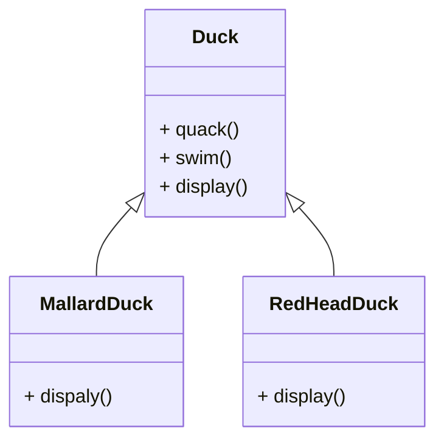
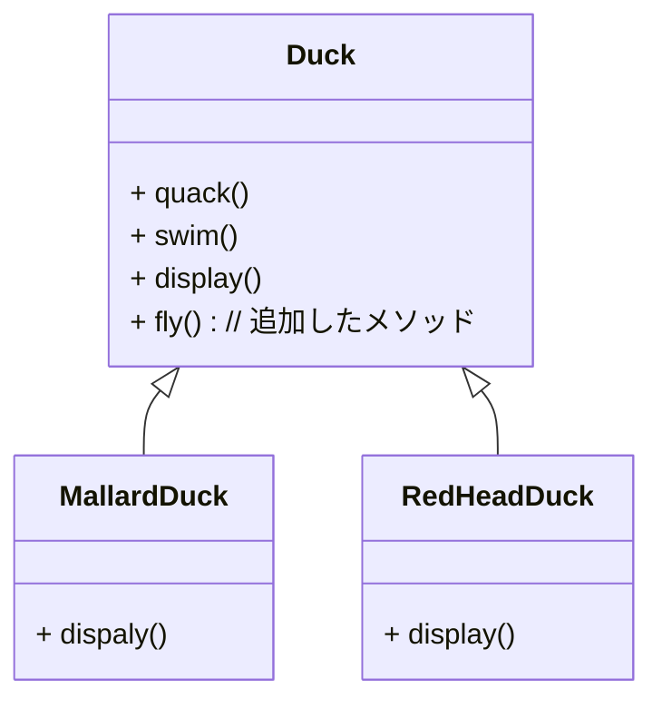
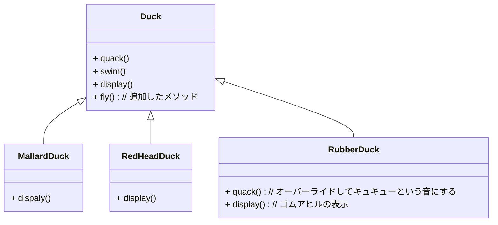

## それは簡単なSimUDuckアプリから始まった
> [!quote] SimUDuckは、泳いだり、鳴いたりするさまざまな種類のカモを表示できます。このシステムの最初の設計者は標準的なOO技術を使用し、すべてのカモの型が継承する1つのDuckスーパークラスを作成しました

- すべてのカモが鳴き声を発したり泳いだりするため、スーパークラスが実装コードを備える
- すべてのカモサブタイプは表示方法が異なるので、display()メソッドは抽象メソッドである
- それぞれのカモサブタイプは、画面上での表示方法を示すdisplay()の振る舞いを独自に実装する

## しかし、カモが「飛ぶ」ようにする必要が出てきてしまった

## しかし事態はひとく悪い方向に進む
> [!warning] 何が起こったのか
> Duckには飛ばないサブクラスがあることに気づかなかった。Duckスーパークラスに新しい振る舞いを追加した際に、一部のDuckサブクラスには**適切ではない**振る舞いも追加してしまった。その結果、SimUDuckプログラムに空飛ぶ無生物を追加してしまった。

## 問題に標準を合わせる
- カモの振る舞いはサブクラスごとに変化し続ける
	- すべてのサブクラスにその振る舞いを持たせることは不適切であるため、継承を使ってもあまりうまくいかないことがわかった
	- FlyableインタフェースとQuackableインタフェース(本当に飛ぶカモだけがFlyableインタフェースを持つなど)最初は見込みがありそうに見えたがインタフェースは実装コードを持たないため、コードを再利用できない
	- 幸運にも、ちょうどこのような状況に対する設計原則がある。

> [!NOTE] 設計原則
> アプリケーション内の変化する部分を特定し、不変な部分と分離する。
> 変化する部分を取り出して「カプセル化」する。すると、不変な部分に影響を与えずに変化する部分を後で変更したり拡張したりできる

